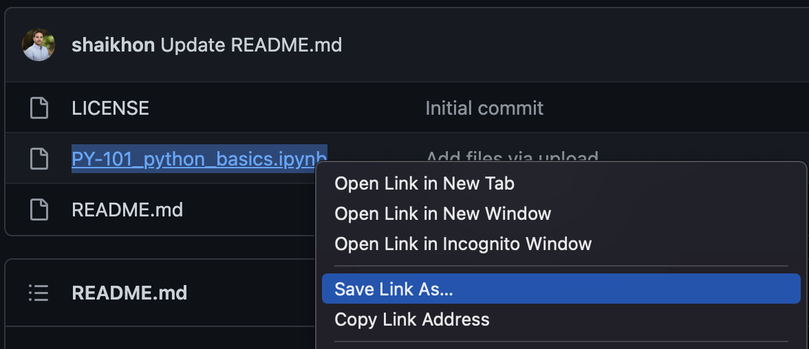

# python-tutorial
A basic Python tutorial as a jupyter notebook for beginners with no programming experience

## Getting Started:
For beginners, it is recommended to upload and run the notebook using the Google's Colab site to skip the Python installation. Here is how to get started immediatly:

  1. Download the tutorial notebook titled: PY-101_python_basics.ipynb (right-click => save as) 
  3. Go to [Google Colab](https://colab.research.google.com/){:target="_blank"}
  4. Log in using your Gmail/Google account (to save your progress)
  5. Upload the PY-101_python_basics.ipynb notebook and get started

## Notebook 1. PY-101_python_basics:
In this notebook, we will cover the following Python basics:

  0. Background information
  1. Built-in types
  2. Operations
  3. Built-in data structures
  4. Built-in functions
  5. Flow control
  6. Creating functions
  7. Bringing it all together
