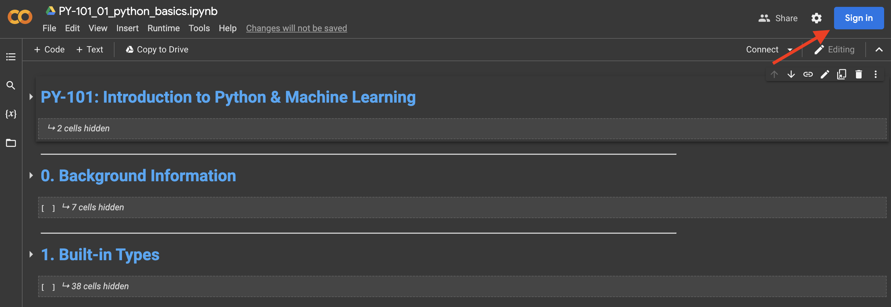
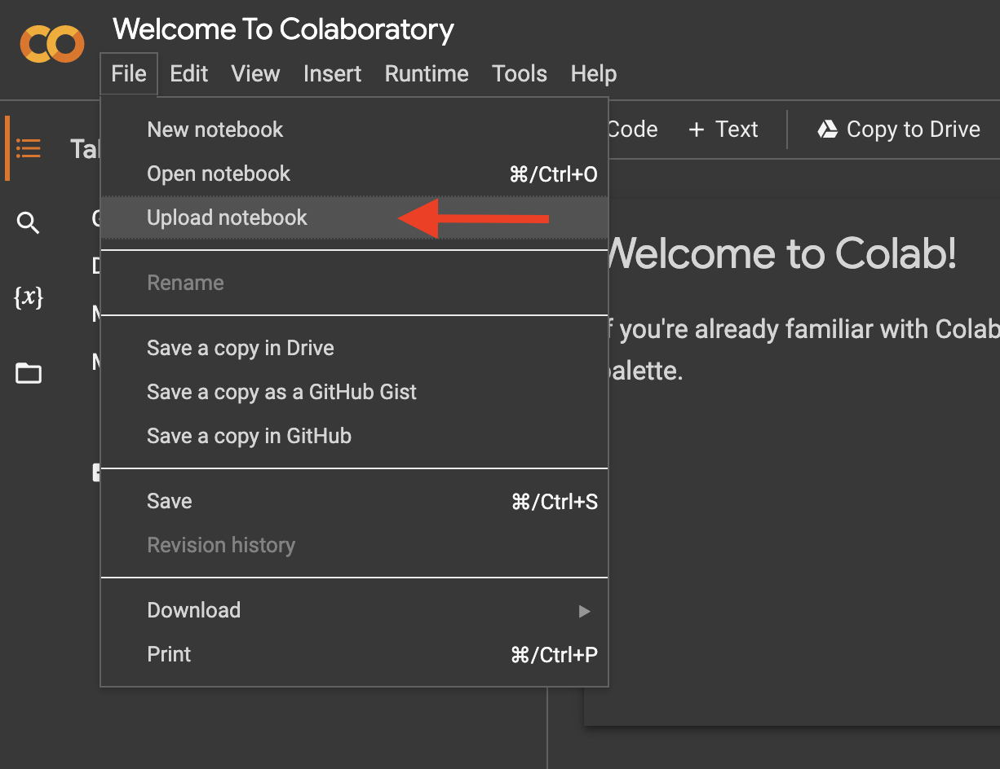

# python-tutorial
A basic Python tutorial as a jupyter notebook for beginners with no programming experience. Zero installation required.

## Getting Started:
For beginners, it is recommended to upload and run the notebook using the Google's Colab site to skip the Python installation. Here is how to get started immediatly:
  
  1. Go to [Google Colab](https://colab.research.google.com/drive/1wqnvJKxU3Uk4KF4wrd_3_BZP7q38J7cq?usp=sharing) & sign in using your Gmail/Google account (to save your progress)
  

  2. Click File > Save 
  
  
#### Notes:
  * Once uploaded and saved, you can access your notebook from any machine. 
  * Your notebook will be saved on the Google cloud... no need to re-upload it. All you have to do is sign into Google Colab.

## Notebook 1. PY-101_python_basics:
In this notebook, we will cover the following Python basics:

  0. Background information
  1. Built-in types
  2. Operations
  3. Built-in data structures
  4. Built-in functions
  5. Flow control
  6. Creating functions
  7. Bringing it all together
