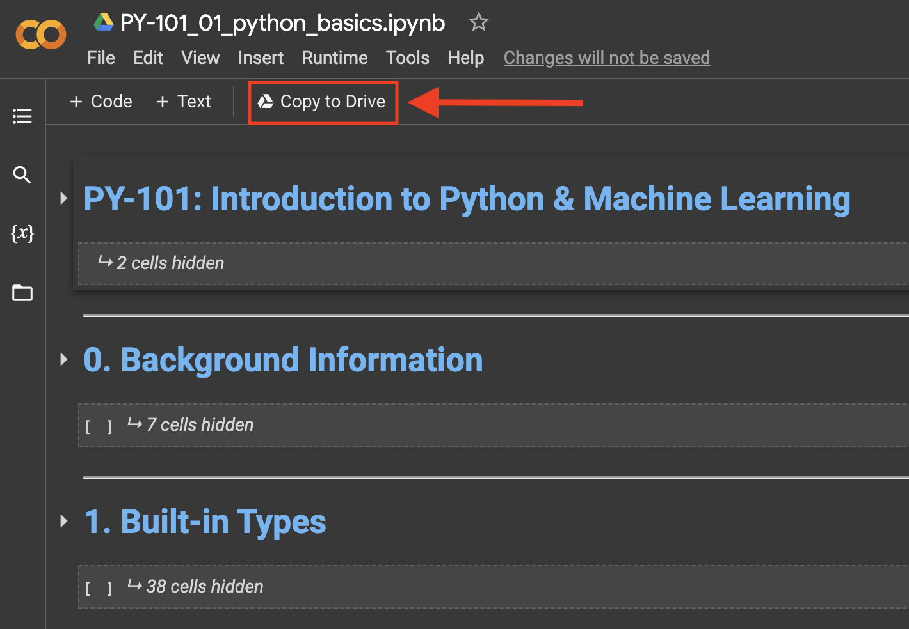

# PY-101 Introduction to Python and Machine Learning
#### Author: Obai Shaikh
#### October 2nd, 2022

A series of Python and Machine Learning tutorials as jupyter notebooks for beginners with no programming experience. Zero installation required.

## Getting Started:
This tutorial uses Google's Colab site to skip the Python installation. Here is how to get started immediatly:
  
  1. Click on one of the notebooks below to open it in Google Colab:
    - [01_Python_Basics](https://colab.research.google.com/drive/1wqnvJKxU3Uk4KF4wrd_3_BZP7q38J7cq?usp=sharing)
    - [02_Numpy_Pandas_Matplotlib]() | coming soon...
    - [03_Intro_to_Machine_Learning]() | coming soon...
  
  2. Sign-in using your Gmail/Google account
  

  3. Click File > Save or "Copy to Drive"
  
  
#### Notes:
  * You must sign-in and save a copy of the notebook to be able to edit it.
  * Once saved, you can access your notebook from any machine. 
  * Your notebook will be saved on the Google cloud... no need to re-upload it. All you have to do is sign into Google Colab.

# Course Content:

## Notebook 1. PY-101_Python_Basics:
  0. Background information
  1. Built-in types
  2. Operations
  3. Built-in data structures
  4. Built-in functions
  5. Flow control
  6. Creating functions
  7. Bringing it all together

